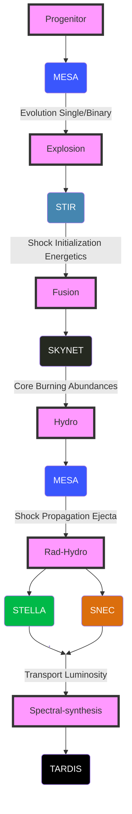

# TARDIS Connector

The TARDIS Connector is an end-to-end pipeline for simulating stripped envelope core-collapse supernovae and calculating spectra and light curves.

```mermaid
flowchart TD
    MESA(MESA)
    MESA2(MESA)
    STIR(STIR)
    SKYNET(SKYNET)
    STELLA(STELLA)
    SNEC(SNEC)
    TARDIS(TARDIS)
    EMPTY[ ]:::empty

    Progenitor --> MESA
    MESA -- Evolution Single/Binary --> Explosion
    Explosion --> STIR
    STIR -- Shock Initialization Energetics --> Fusion
    Fusion --> SKYNET
    SKYNET -- Core Burning Abundances --> Hydro
    Hydro --> MESA2
    MESA2 -- Shock Propagation Ejecta --> Rad-Hydro
    Rad-Hydro --> STELLA
    Rad-Hydro --> SNEC
    STELLA --> EMPTY
    SNEC --> EMPTY
    EMPTY -- Transport Luminosity --> Spectral-synthesis
    Spectral-synthesis --> TARDIS

    style Progenitor fill:#f9f,stroke:#333,stroke-width:4px
    style Explosion fill:#f9f,stroke:#333,stroke-width:4px
    style Fusion fill:#f9f,stroke:#333,stroke-width:4px
    style Hydro fill:#f9f,stroke:#333,stroke-width:4px
    style Rad-Hydro fill:#f9f,stroke:#333,stroke-width:4px
    style Spectral-synthesis fill:#f9f,stroke:#333,stroke-width:4px
    style MESA fill:#3a56fd,color:#fff
    style MESA2 fill:#3a56fd,color:#fff
    style STIR fill:#4586b0,color:#fff
    style SKYNET fill:#252920,color:#fff
    style STELLA fill:#00b948,color:#fff
    style SNEC fill:#db6e0d,color:#fff
    style TARDIS fill:#000,color:#fff
    classDef empty width:1px,height:1px;
```
